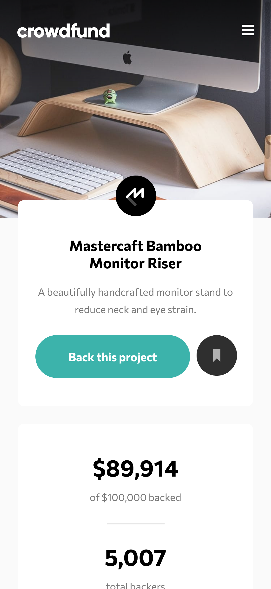

# Frontend Mentor - Crowdfunding product page solution

This is a solution to the [Crowdfunding product page challenge on Frontend Mentor](https://www.frontendmentor.io/challenges/crowdfunding-product-page-7uvcZe7ZR). Frontend Mentor challenges help you improve your coding skills by building realistic projects.

## Table of contents

- [Overview](#overview)
  - [The challenge](#the-challenge)
  - [Screenshot](#screenshot)
  - [Links](#links)
- [My process](#my-process)
  - [Built with](#built-with)
  - [What I learned](#what-i-learned)
  - [Continued development](#continued-development)
  - [Useful resources](#useful-resources)
- [Author](#author)

## Overview

### The challenge

Users should be able to:

- View the optimal layout depending on their device's screen size
- See hover states for interactive elements
- Make a selection of which pledge to make
- See an updated progress bar and total money raised based on their pledge total after confirming a pledge
- See the number of total backers increment by one after confirming a pledge
- Toggle whether or not the product is bookmarked

### Screenshot



### Links

- [Solution](https://github.com/vincitaylaran/crowdfunding-product-page)
- [Live Site](https://confident-varahamihira-54216d.netlify.app/)

## My process

### Built with

- Semantic HTML5 markup
- CSS custom properties
- Flexbox
- CSS Grid
- Mobile-first workflow
- [React](https://reactjs.org/) - JS library
- [Gatsby](https://www.gatsbyjs.com/) - React framework
- [SASS](https://sass-lang.com/) - For styles

### What I learned

Use this section to recap over some of your major learnings while working through this project. Writing these out and providing code samples of areas you want to highlight is a great way to reinforce your own knowledge.

To see how you can add code snippets, see below:

#### Progress Bar component


```jsx
// What I learned: dynamically changing the width of the inner colored bar by passing in the product of the following formula -> (current donations / donations goal) * 100

const ProgressBar = ({ ...props }) => {
  return (
    <div
      style={{
        width: "100%",
        borderRadius: 33.5,
        background: "rgb(245, 245, 245)",
        height: 12,
      }}
    >
      <div
        style={{
          borderRadius: "inherit",
          background: "#3CB3AB",
          width: `${props.progress}%`, // Sets width based on (current donations / donations goal) * 100
          maxWidth: "100%", // Set the max width just in case donations exceed the goal.
          color: "#3CB3AB",
          height: "100%",
        }}
      ></div>
    </div>
  )
}
```

### Continued development

Use this section to outline areas that you want to continue focusing on in future projects. These could be concepts you're still not completely comfortable with or techniques you found useful that you want to refine and perfect.

**Note: Delete this note and the content within this section and replace with your own plans for continued development.**

### Useful resources

- [Gatsby docs](https://www.gatsbyjs.com/docs/) - For obvious reasons, the docs helped me understand plugins, themes, project structure, and CSS Modules. I still need to read further so I can fully graspy the potential of plugins and themes.
- [What is Gatsby and Why Use It](https://www.youtube.com/watch?v=GuvAMcsoreI&list=LL&index=13) - This is an amazing video explaining the practical benefits of using Gatsby. It goes into detail about what a static site generator is, how Gatsby fetches data via GraphQL, and why you should use Gatsby.

## Author

- Website - [Vinci Taylaran](https://www.vincitaylaran.com)
- Frontend Mentor - [@vincitaylaran](https://www.frontendmentor.io/profile/vincitaylaran)
- Twitter - [@vin_ceeee](https://twitter.com/vin_ceeee)
